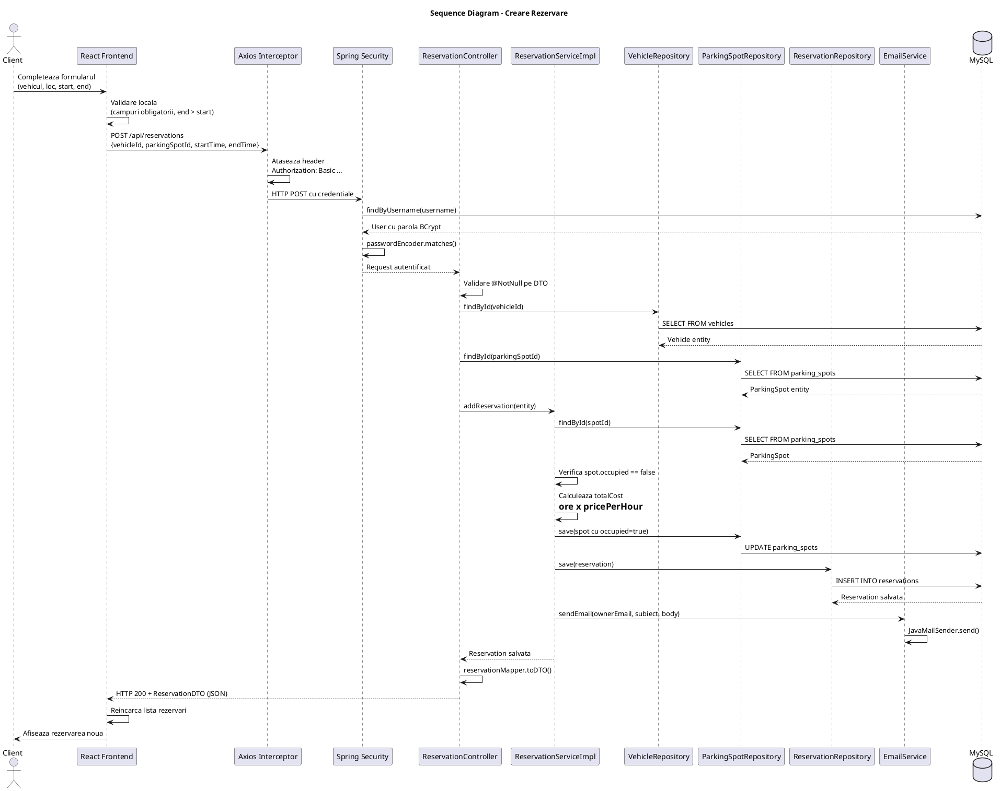
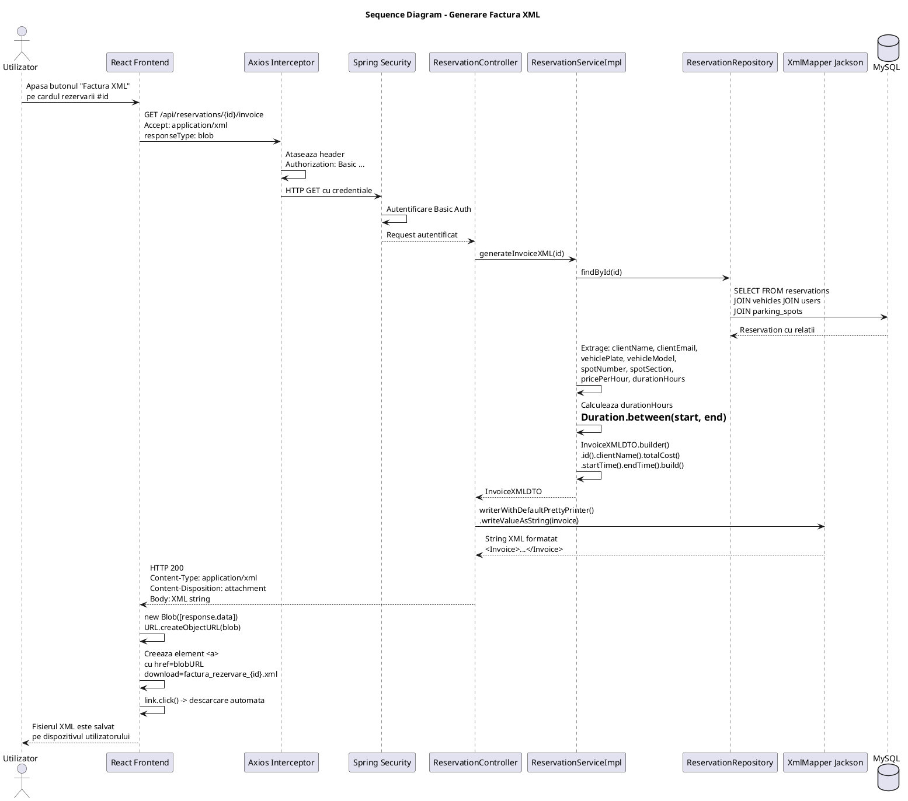
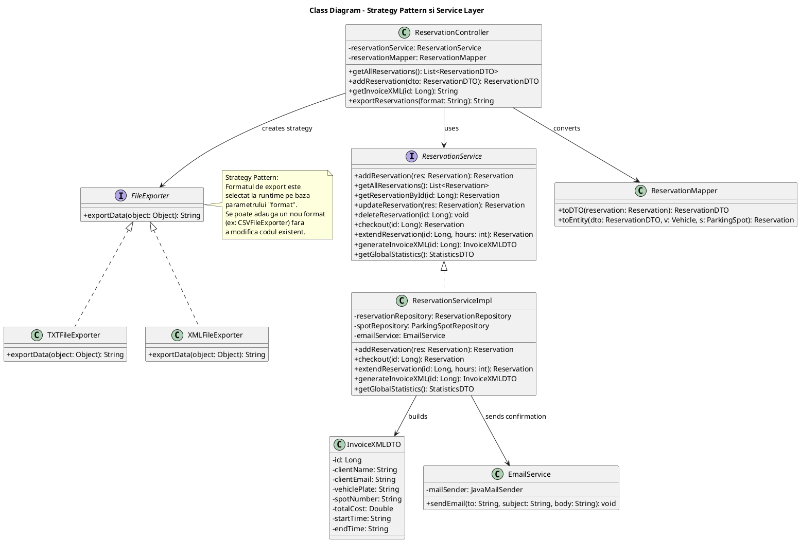
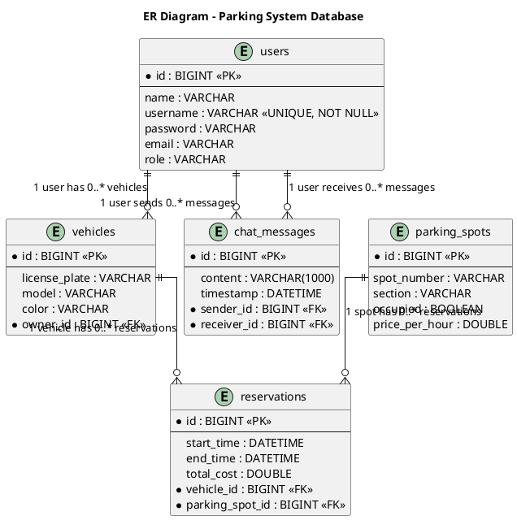

Deliverable 3 -- Design Detaliat, Testare si Concluzii (Parking System)

Proiect: Parking System
Tehnologii: Spring Boot 4.0.3 + React (Material UI) + MySQL
Autor: Bogdan Campean
Data: Mai 2026

================================================================================
1. DESIGN MODEL -- DYNAMIC BEHAVIOR (SEQUENCE DIAGRAMS)
================================================================================

1.1. Scenariul 1: Crearea unei Rezervari cu Validare si Trimitere Email
-------------------------------------------------------------------------

Acest scenariu descrie fluxul complet care se desfasoara atunci cand un client autentificat doreste sa creeze o noua rezervare. Utilizatorul completeaza formularul din interfata React (selecteaza vehiculul, locul de parcare, data de inceput si data de sfarsit), iar frontend-ul valideaza local campurile obligatorii si verifica ca data de sfarsit este ulterioara datei de inceput. Daca validarile locale trec, frontend-ul trimite un request HTTP POST catre endpoint-ul /api/reservations, cu header-ul Authorization Basic atasat automat de interceptorul Axios. Pe server, Spring Security verifica mai intai credentialele din header (prin CustomUserDetailsService care incarca utilizatorul din baza de date si compara parola BCrypt). Daca autentificarea reuseste, cererea ajunge la ReservationController, care valideaza DTO-ul cu adnotarile Jakarta Validation (@NotNull pe vehicleId, parkingSpotId, startTime, endTime). Daca validarea trece, controller-ul cauta vehiculul si locul de parcare in baza de date prin VehicleRepository si ParkingSpotRepository. Apoi deleaga catre ReservationServiceImpl, care verifica daca locul nu este deja ocupat, calculeaza costul total (numar ore inmultit cu pretul pe ora), marcheaza locul ca ocupat, salveaza rezervarea in baza de date si trimite un email de confirmare proprietarului vehiculului prin EmailService. Raspunsul cu DTO-ul rezervarii create este returnat catre frontend, care reincarca lista de rezervari.

1.2. Scenariul 2: Generarea si Descarcarea Facturii XML
---------------------------------------------------------

Acest scenariu descrie fluxul prin care un utilizator autentificat descarca factura in format XML pentru o rezervare existenta. Utilizatorul apasa butonul "Factura XML" de pe cardul unei rezervari din interfata React. Frontend-ul trimite un request HTTP GET catre endpoint-ul /api/reservations/{id}/invoice cu header-ul Accept: application/xml si responseType: blob. Dupa autentificarea prin Spring Security, cererea ajunge la ReservationController care apeleaza metoda generateInvoiceXML din ReservationServiceImpl. Serviciul incarca rezervarea din baza de date, extrage toate informatiile necesare (nume client, email, numar vehicul, model, loc, sectiune, pret pe ora, durata, cost total, date start/end) si construieste un obiect InvoiceXMLDTO folosind Builder Pattern (Lombok @Builder). Controller-ul instantiaza un XmlMapper din Jackson si serializeaza DTO-ul intr-un string XML formatat cu pretty print, avand elementul radacina Invoice. Raspunsul HTTP este configurat cu Content-Type application/xml si Content-Disposition attachment, astfel incat browser-ul sa declanseze descarcarea automata. Pe frontend, raspunsul de tip blob este convertit intr-un URL temporar cu URL.createObjectURL(), este creat un element anchor invizibil care declanseaza download-ul, iar fisierul factura_rezervare_{id}.xml este salvat pe dispozitivul utilizatorului.

================================================================================
2. DESIGN MODEL -- CLASS DIAGRAM (GoF Design Patterns)
================================================================================

2.1. Descrierea Diagramei de Clase si a Pattern-urilor GoF
------------------------------------------------------------

Diagrama de clase a stratului de logica (business layer) din Parking System evidentiaza modul in care clasele sunt organizate si cum interactioneaza intre ele. Accentul este pus pe doua zone principale: ierarhia de servicii (care urmeaza principiul Dependency Inversion prin interfete si implementari concrete) si sistemul de export al datelor (care aplica explicit Strategy Pattern).

Stratul de servicii este organizat pe interfete si implementari. Interfata ReservationService defineste contractul pentru operatiile de business legate de rezervari: addReservation, getAllReservations, getReservationById, updateReservation, deleteReservation, checkout, extendReservation, generateInvoiceXML si getGlobalStatistics. Implementarea concreta ReservationServiceImpl contine toata logica: verificarea disponibilitatii locului de parcare, calculul costurilor pe baza duratei si pretului pe ora, marcarea locului ca ocupat/liber, trimiterea email-ului de confirmare si construirea obiectului InvoiceXMLDTO pentru facturi. Acelasi model se aplica pentru VehicleService/VehicleServiceImpl si ParkingSpotService/ParkingSpotServiceImpl. Aceasta separare permite inlocuirea implementarii fara a afecta clasele care depind de interfata (principiul Open/Closed si Dependency Inversion din SOLID).

Strategy Pattern este aplicat explicit in sistemul de export al rezervarilor. Interfata FileExporter defineste o singura metoda: exportData(Object object) care returneaza un String. Doua implementari concrete exista: TXTFileExporter, care converteste obiectul primit la reprezentarea sa textuala prin apelul toString(), si XMLFileExporter, care serializeaza obiectul in format XML structurat folosind JAXB Marshaller (JAXBContext, Marshaller cu JAXB_FORMATTED_OUTPUT). In ReservationController, metoda exportReservations primeste un parametru de query "format" si, in functie de valoarea acestuia ("txt" sau "xml"), instantiaza strategia corespunzatoare. Restul codului din metoda este identic indiferent de format: se apeleaza exporter.exportData() pe fiecare rezervare, iar rezultatul este returnat ca raspuns HTTP cu Content-Type si Content-Disposition corespunzatoare. Avantajul principal al acestui pattern este extensibilitatea: daca in viitor se doreste adaugarea unui format nou de export (de exemplu CSV sau JSON), se creeaza o noua clasa care implementeaza FileExporter, fara a modifica codul existent din controller sau din celelalte strategii.

Builder Pattern este folosit extensiv prin adnotarile Lombok @Builder pe entitatile JPA si pe DTO-uri. Cel mai reprezentativ exemplu este constructia obiectului InvoiceXMLDTO in metoda generateInvoiceXML din ReservationServiceImpl, unde se apeleaza InvoiceXMLDTO.builder().id(res.getId()).clientName(clientName).vehiclePlate(vehiclePlate)...build(). Acest pattern elimina nevoia de constructori cu multi parametri si face codul mai lizibil.

Repository Pattern este aplicat prin Spring Data JPA. Fiecare entitate are un repository care extinde JpaRepository si ofera automat operatii CRUD. Query-urile custom sunt derivate din numele metodei: findByUsername, findByOccupied, findByRole, existsByEmail, findConversation. Aceasta abstractizare ascunde complet implementarea SQL si permite schimbarea bazei de date fara a modifica codul de business.

2.2. Class Diagram cu Strategy Pattern (PlantUML)
----------------------------------------------------

================================================================================
3. DATA MODEL (ER DIAGRAM)
================================================================================

3.1. Descrierea Structurii Bazei de Date
------------------------------------------

Baza de date a sistemului Parking System este o baza de date relationala MySQL numita "parking_system", cu schema generata automat de Hibernate (spring.jpa.hibernate.ddl-auto=update). Structura contine cinci tabele principale legate intre ele prin chei straine (Foreign Keys).

Tabelul "users" stocheaza utilizatorii sistemului, cu coloane pentru id (cheie primara auto-incrementata), name, username (unic, not null), password (hash BCrypt), email si role (ROLE_ADMIN sau ROLE_CLIENT).

Tabelul "vehicles" stocheaza vehiculele inregistrate, cu coloane pentru id, license_plate, model, color si owner_id (cheie straina catre users.id). Relatia este Many-to-One: mai multe vehicule pot apartine aceluiasi utilizator.

Tabelul "parking_spots" stocheaza locurile de parcare, cu coloane pentru id, spot_number, section, occupied (boolean) si price_per_hour (valoare numerica in RON).

Tabelul "reservations" stocheaza rezervarile, legand un vehicul de un loc de parcare pe un interval de timp. Coloane: id, vehicle_id (cheie straina catre vehicles.id), parking_spot_id (cheie straina catre parking_spots.id), start_time, end_time si total_cost.

Tabelul "chat_messages" stocheaza mesajele de chat, cu coloane pentru id, sender_id (cheie straina catre users.id), receiver_id (cheie straina catre users.id), content si timestamp.

3.2. Diagrama Entitate-Relatie (PlantUML)
-------------------------------------------

================================================================================
4. SYSTEM TESTING
================================================================================

4.1. Metodele de Testare Utilizate
------------------------------------

Testarea sistemului Parking System a fost realizata preponderent prin testare manuala end-to-end, utilizand interfata React din browser pentru a simula fluxurile reale ale utilizatorilor. Au fost verificate urmatoarele aspecte principale:

Testarea functionala a operatiilor CRUD: s-au creat, editat si sters vehicule, locuri de parcare si rezervari prin interfata grafica, verificand ca datele sunt salvate corect in baza de date MySQL si ca sunt afisate corect dupa reload.

Testarea securitatii si a restrictiilor de acces: s-a verificat ca un utilizator cu rolul ROLE_CLIENT nu poate accesa paginile de statistici sau nu poate adauga/edita/sterge locuri de parcare (operatii rezervate ROLE_ADMIN). S-a verificat ca accesul la endpoint-urile protejate fara credentiale valide returneaza HTTP 401 si ca interceptorul Axios redirectioneaza automat la pagina de login.

Testarea validarilor de date: s-a verificat ca validatorul custom @ValidLicensePlate respinge numerele de inmatriculare care nu respecta formatul romanesc (judet-numar-litere). S-au testat validarile @NotNull si @NotBlank din backend prin trimiterea de formulare incomplete, verificand ca mesajele de eroare sunt afisate corect in interfata.

Testarea functionalitatilor avansate: s-a verificat generarea si descarcarea facturii XML, trimiterea email-ului de confirmare la crearea rezervarii, functionarea chat-ului live intre administrator si client prin WebSocket si aparitia notificarilor de expirare a rezervarilor.

4.2. Cazuri de Testare
------------------------

Test Case 1: Validare numar de inmatriculare invalid

Nume test: Adaugare vehicul cu numar de inmatriculare invalid
Descriere: Se incearca adaugarea unui vehicul cu un numar de inmatriculare care nu respecta formatul romanesc standard (judet-numar-litere).
Date de intrare: licensePlate = "XYZ-9999-QQQ", model = "Dacia Logan", color = "Alb", ownerId = 1
Actiune: Se completeaza formularul de adaugare vehicul din interfata React si se apasa butonul de salvare.
Rezultat asteptat: Cererea este respinsa de backend cu HTTP 400 Bad Request. Mesajul de eroare afisat este "Numarul de inmatriculare este invalid!" (provenit din validatorul @ValidLicensePlate). Vehiculul nu este salvat in baza de date.
Rezultat obtinut: Comportament conform asteptarilor. Mesajul de eroare apare in formularul din frontend, vehiculul nu este salvat. La introducerea unui numar valid (ex: CJ-123-ABC), vehiculul se salveaza cu succes.

Test Case 2: Creare rezervare pe un loc de parcare deja ocupat

Nume test: Tentativa de rezervare pe un loc ocupat
Descriere: Se incearca crearea unei rezervari pe un loc de parcare care este deja marcat ca ocupat de o alta rezervare activa.
Date de intrare: vehicleId = 2, parkingSpotId = 1 (loc deja ocupat), startTime = "2026-05-25T10:00", endTime = "2026-05-25T14:00"
Actiune: Se selecteaza locul de parcare ocupat din dropdown (afisat cu indicatia "Ocupat") si se apasa Confirma.
Rezultat asteptat: Cererea este respinsa de backend cu HTTP 400 Bad Request. Mesajul de eroare este "Locul de parcare este deja ocupat!" (aruncat de ReservationServiceImpl ca IllegalStateException). Nicio rezervare noua nu este creata, starea locului ramane neschimbata.
Rezultat obtinut: Comportament conform asteptarilor. In plus, dropdown-ul din frontend dezactiveaza vizual optiunea locurilor ocupate, prevenind selectarea lor inainte de submit.

Test Case 3: Accesul unui Client la pagina de Statistici (restrictie de rol)

Nume test: Acces neautorizat la statistici de catre un Client
Descriere: Se verifica ca un utilizator cu rolul ROLE_CLIENT nu poate accesa endpoint-ul de statistici, care este rezervat exclusiv pentru ROLE_ADMIN.
Date de intrare: Utilizatorul este autentificat cu un cont de tip CLIENT (ex: username = "ion", role = ROLE_CLIENT).
Actiune: Se incearca accesarea directa a URL-ului /api/stats din browser sau prin modificarea codului frontend.
Rezultat asteptat: Backend-ul returneaza HTTP 403 Forbidden deoarece SecurityFilterChain are regula requestMatchers("/api/stats/**").hasRole("ADMIN"). Datele de statistici nu sunt returnate. In interfata React, meniurile de Statistici, Masini si Locuri Parcare nu sunt vizibile pentru rolul CLIENT (filtrare conditionala in componenta App.js).
Rezultat obtinut: Comportament conform asteptarilor. Utilizatorul CLIENT nu vede meniurile administrative in bara de navigare. La tentativa de acces direct la endpoint, primeste raspuns HTTP 403 fara date.

================================================================================
5. FUTURE IMPROVEMENTS
================================================================================

O prima directie de dezvoltare viitoare este integrarea unui sistem de plati online. In prezent, costul rezervarii este calculat automat de sistem, dar plata efectiva nu este procesata prin aplicatie. Prin integrarea unui procesator de plati precum Stripe sau PayPal, utilizatorii ar putea plati rezervarea direct din interfata web, iar sistemul ar genera automat o factura fiscala completa (nu doar o chitanta informativa in format XML). Aceasta ar transforma aplicatia dintr-un instrument de administrare intr-o platforma completa de self-service pentru clientii parcarii.

O a doua imbunatatire ar fi implementarea unui sistem de notificari SMS pe langa notificarile WebSocket existente. In prezent, notificarile de expirare a rezervarilor sunt trimise doar prin WebSocket, ceea ce presupune ca utilizatorul are aplicatia deschisa in browser. Prin integrarea unui serviciu SMS (de exemplu Twilio), utilizatorii ar primi alerte si atunci cand nu sunt conectati la aplicatie. De asemenea, confirmarea rezervarii ar putea fi trimisa atat pe email (cum se face in prezent) cat si prin SMS, oferind redundanta in comunicare.

O a treia directie interesanta este implementarea unui sistem de recunoastere automata a numarului de inmatriculare (ANPR - Automatic Number Plate Recognition) folosind o camera video montata la bariera parcarii. La intrarea in parcare, camera ar captura imaginea placutei de inmatriculare, un serviciu de procesare de imagine (bazat pe OpenCV sau un API cloud precum Google Vision) ar extrage numarul, iar sistemul ar verifica automat daca exista o rezervare activa pentru acel numar. Bariera s-ar ridica automat pentru vehiculele cu rezervare valida, eliminand necesitatea interactiunii manuale. Aceasta functionalitate ar necesita adaugarea unui modul de integrare IoT in backend si un endpoint dedicat pentru validarea in timp real.

In plus, sistemul ar beneficia de adaugarea unui mecanism de rapoarte si analize avansate, cu grafice interactive (folosind o biblioteca precum Chart.js sau Recharts in React), care sa permita administratorului sa vizualizeze tendintele de ocupare pe zile si ore, veniturile pe perioade si utilizarea pe sectiuni ale parcarii. Aceste date ar ajuta la optimizarea preturilor si la planificarea extinderii capacitatii parcarii.

================================================================================
6. CONCLUSION
================================================================================

Sistemul Parking System reprezinta o aplicatie web full-stack completa, construita pe o arhitectura moderna si scalabila, cu separare clara intre frontend si backend. Frontend-ul dezvoltat in React JS ofera o interfata responsiva si intuitiva, utilizand componente Material UI pentru un aspect profesional si consistent. Navigarea prin aplicatie este fluida datorita React Router, iar comunicarea cu serverul este gestionata centralizat prin Axios cu interceptori care asigura atasarea automata a credentialelor de autentificare la fiecare request.

Backend-ul dezvoltat in Spring Boot 4.0.3 implementeaza o arhitectura stratificata robusta (Controller, Service, Repository) care respecta principiile SOLID si faciliteaza mentenanta si extensibilitatea codului. Utilizarea Spring Data JPA pentru accesul la baza de date MySQL elimina necesitatea scrierii manuale de query-uri SQL pentru operatiile standard, iar query-urile custom sunt derivate automat din numele metodelor definite in interfetele Repository. Mapperele dedicate asigura o separare stricta intre entitatile de domeniu si obiectele de transfer (DTO-uri), prevenind expunerea structurii interne a bazei de date catre clienti.

Securitatea sistemului este asigurata prin Spring Security cu autentificare HTTP Basic Auth si criptare BCrypt a parolelor. Configurarea SecurityFilterChain defineste reguli granulare de acces pe endpoint-uri si metode HTTP, diferentiind clar intre operatiile disponibile administratorilor si cele disponibile clientilor. Sesiunile sunt configurate ca stateless, ceea ce face backend-ul pregatit pentru scalare orizontala. Validarea datelor este realizata pe doua niveluri (frontend si backend), cu un validator custom pentru numerele de inmatriculare romanesti care demonstreaza capacitatea de a extinde mecanismul standard de validare Jakarta.

Aplicarea design pattern-urilor GoF (Strategy Pattern pentru exportul de date, Builder Pattern pentru constructia obiectelor complexe, Repository Pattern pentru accesul la date, Observer Pattern implicit prin WebSocket) demonstreaza o intelegere solida a principiilor de design orientat obiect si contribuie la un cod modular si extensibil. Functionalitatile avansate precum generarea facturilor XML, trimiterea email-urilor de confirmare, notificarile in timp real prin WebSocket si chat-ul live intre clienti si administrator ridica sistemul deasupra unui simplu CRUD, oferind o experienta completa de administrare a unei parcari.

In concluzie, aplicatia Parking System isi indeplineste pe deplin scopul propus: ofera un sistem functional, securizat si extensibil pentru gestionarea vehiculelor, a locurilor de parcare si a rezervarilor, cu suport pentru comunicare in timp real si generare de documente structurate. Arhitectura aleasa permite adaugarea usoara de noi functionalitati in viitor fara a compromite stabilitatea sistemului existent.

================================================================================
7. BIBLIOGRAPHY
================================================================================

1. Spring Boot Reference Documentation, VMware Inc., 2024. Disponibil online la: https://docs.spring.io/spring-boot/docs/current/reference/htmlsingle/

2. Spring Security Reference Documentation, VMware Inc., 2024. Disponibil online la: https://docs.spring.io/spring-security/reference/index.html

3. React Official Documentation, Meta Platforms Inc., 2024. Disponibil online la: https://react.dev/

4. PlantUML Language Reference Guide, Arnaud Roques, 2024. Disponibil online la: https://plantuml.com/guide

5. Gamma, E., Helm, R., Johnson, R., Vlissides, J. -- Design Patterns: Elements of Reusable Object-Oriented Software, Addison-Wesley Professional, 1994. ISBN: 978-0201633610.

6. Material UI (MUI) Documentation, MUI Team, 2024. Disponibil online la: https://mui.com/material-ui/getting-started/

7. MySQL 8.0 Reference Manual, Oracle Corporation, 2024. Disponibil online la: https://dev.mysql.com/doc/refman/8.0/en/
